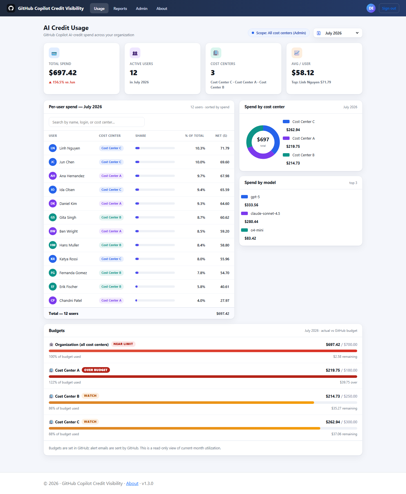
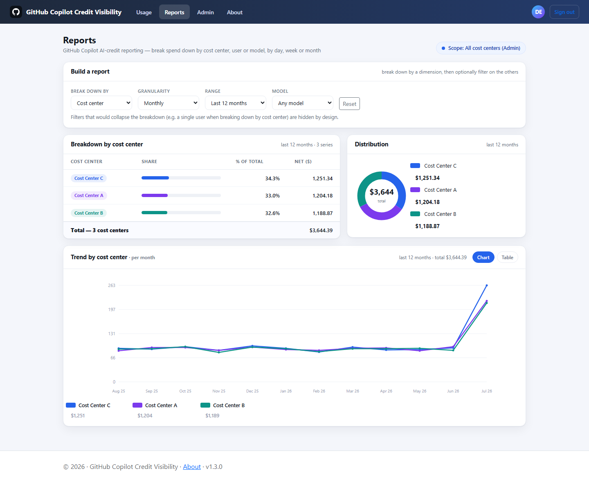
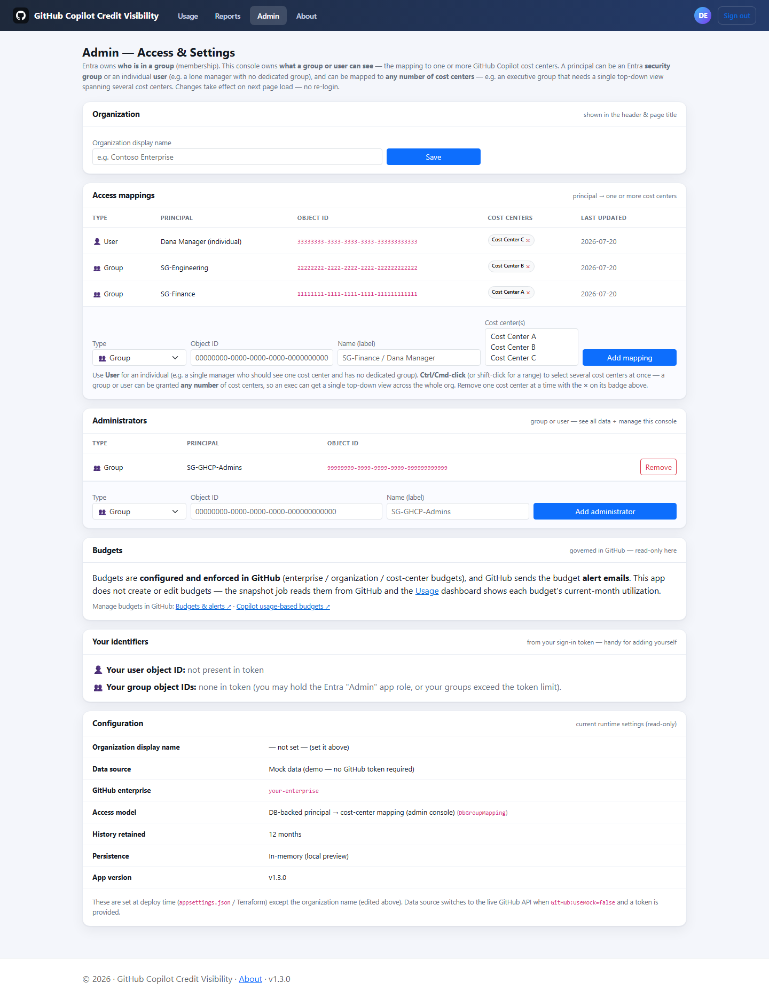
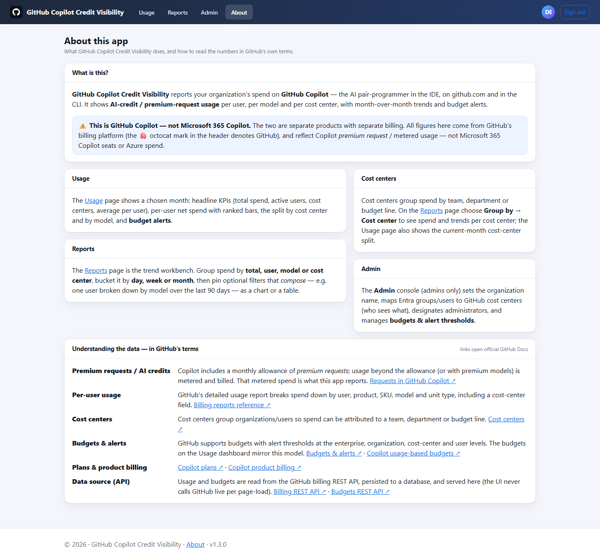
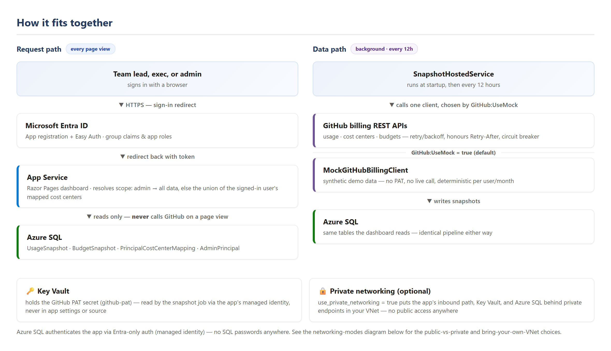
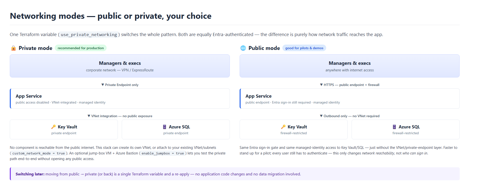

# GitHub Copilot AI Credit Visibility

**See exactly where your organization's GitHub Copilot AI-credit spend is going** — per user, per
cost center, per AI model — with multi-month trends, budget tracking, and self-service
Entra-group-based access, deployed privately in **your own** Azure subscription.

<p align="left">
  
</p>

> Built for platform/IT teams who've rolled out GitHub Copilot and now need to answer "who's
> using it, how much is it costing, and is any team about to blow through budget?" — without
> waiting on a spreadsheet export or opening a GitHub support ticket every month.

---

## Contents

- [What this app does](#what-this-app-does)
- [Screenshots](#screenshots)
- [Features](#features)
- [Architecture](#architecture)
- [Quickstart](#quickstart)
- [Deploying to Azure](#deploying-to-azure)
- [The admin console — who sees what](#the-admin-console--who-sees-what)
- [Demo / mock data](#demo--mock-data)
- [Going live with real GitHub data](#going-live-against-real-github-data)
- [Repository layout](#repository-layout)
- [Cost notes](#cost-notes)
- [Contributing](#contributing)

## What this app does

GitHub Copilot's billing model includes a monthly allowance of **premium requests**; usage beyond
that allowance (or against premium models) is **metered and billed as AI credits**. GitHub exposes
that spend via billing APIs and CSV exports, but there's no built-in, always-on, **role-scoped**
dashboard — finance wants a monthly total, a manager wants their team's number, and an executive
wants a cross-org rollup, and today that means someone manually pulling and slicing a report.

This app closes that gap:
- A background job snapshots GitHub's billing/usage/budget APIs into your own database on a
  schedule — **the dashboard itself never calls GitHub live**, so it's fast and resilient to
  GitHub API hiccups.
- Signed-in users see **only the cost centers they're entitled to** (see
  [the admin console](#the-admin-console--who-sees-what)) — a team lead sees their team, an
  executive can see a curated set of cost centers spanning the whole org, and an admin sees
  everything.
- It runs entirely inside **your own Azure subscription**, behind **Microsoft Entra ID**
  authentication, with secrets in Key Vault and, for production, a fully private network path
  (no public endpoints at all).
- It works **out of the box on synthetic demo data** — you can deploy it, click around, and
  configure the access model before you ever hand over a GitHub PAT. See
  [Demo / mock data](#demo--mock-data).

> **This is GitHub Copilot, not Microsoft 365 Copilot.** These are two separate Microsoft/GitHub
> products with entirely separate billing. Every number in this app comes from GitHub's Copilot
> billing platform — not Microsoft 365 Copilot seats, and not general Azure spend.

## Screenshots

| Usage dashboard | Reports (trend builder) |
|---|---|
|  |  |

| Admin console — access mappings | About page (in-app documentation) |
|---|---|
|  |  |

*(Screenshots above were captured from a local run against the built-in synthetic demo data —
see [Demo / mock data](#demo--mock-data). Your real deployment will show your organization's
actual users, cost centers, and spend.)*

## Features

- **Per-user, per-cost-center, and per-model spend breakdown**, with multi-month trend history
  and a flexible report builder (break down by user/model/cost center; bucket by day/week/month;
  filter and compare).
- **Budget tracking** — reads the budgets and thresholds you've configured *in GitHub* (this app
  never creates or edits budgets) and shows current-month utilization with near-limit/over-budget
  callouts. GitHub still sends the actual alert emails.
- **Microsoft Entra ID authentication** (Azure App Service Easy Auth) — no anonymous access, ever.
- **Group- and user-based access scoping, many-to-many** — an in-app Admin console maps Entra
  security groups *and/or* individual users to **one or more** GitHub cost centers each. An
  executive who needs a single top-down view spanning several cost centers is a first-class case,
  not a workaround — map their group to as many cost centers as needed in one place. No redeploy
  or re-login needed to change a mapping; it takes effect on the next page load.
- **No live GitHub calls on page load** — a scheduled background job snapshots usage into your
  own database; the dashboard only ever reads from it.
- **Resilient GitHub API client** — retry with exponential backoff and jitter, honours
  `Retry-After`, circuit breaker, request timeout.
- **Persistent history** in Azure SQL (or an in-memory store for local preview), with automatic
  retention purge (configurable, default 12 months).
- **Secrets in Key Vault**, accessed via managed identity — never in app settings, code, or
  Terraform state.
- **Runs on synthetic mock data out of the box** — no GitHub PAT required to try it out, demo it,
  or configure the access model ahead of go-live.
- **Two deployment networking patterns** — fully public (fastest to try, still Entra-gated) or
  fully private (VNet, private endpoints, private DNS, no public access anywhere), switched with
  one Terraform variable.
- **Bring-your-own VNet or let it create one**, with an optional **jump box + Azure Bastion** so
  you can test the private network path end-to-end without opening any public access — see
  [infra/README.md](infra/README.md#jump-box--azure-bastion-test-the-private-network-end-to-end).

## Architecture

<p align="left">
  
</p>

**Request path:** a browser hits the app → Azure App Service **Easy Auth** redirects to
**Entra ID** for sign-in → the app resolves the signed-in user's **scope** (all data if admin,
otherwise the union of cost centers mapped to their groups/user ID) → the Razor Pages dashboard
queries **only the database** — it never calls GitHub on a user request.

**Data path:** an in-process background job (`SnapshotHostedService`) runs on startup and every
12 hours, calls the GitHub billing APIs (or the mock client — see
[Demo / mock data](#demo--mock-data)), and writes rows into Azure SQL. This keeps the web tier
fast and insulates it from GitHub API latency/outages.

**Identity/secrets:** the app's managed identity reads the GitHub PAT from Key Vault (never in
app settings or source) and authenticates to Azure SQL via Entra-only auth (no SQL passwords
anywhere).

### Networking modes — public or private, your choice

<p align="left">
  
</p>

See [infra/README.md](infra/README.md) for the full resource list, the bring-your-own-VNet path,
and the optional jump box + Bastion for testing the private path end-to-end.

## Quickstart

Try it locally in a couple of minutes, on synthetic data, with no Azure subscription and no
GitHub PAT:

```bash
cd GhcpCreditVisibility
dotnet run
```

Open the HTTPS URL it prints. You'll land straight on the Usage dashboard as an auto-signed-in
admin — no sign-in step locally. **New to .NET, or want the full novice-friendly walkthrough
(installing the SDK, trusting the dev cert, troubleshooting) for both bash and PowerShell?**
See **[docs/RUN_LOCALLY.md](docs/RUN_LOCALLY.md)**.

## Deploying to Azure

The full deployment is Terraform-based and lives in [`infra/`](infra), driven by one guided
script:

```powershell
./deploy.ps1
```

`deploy.ps1` walks you through: prerequisite/quota checks → interactive configuration
(`terraform.tfvars`) → `terraform apply` → building this app's container image in the cloud (no
local Docker needed) → the one-time SQL grant → optionally seeding the GitHub PAT → a health
check. Run a single phase with `-Task <name>` or preview everything with `-DryRun`.

Key deployment choices, all one Terraform variable each:

| Choice | Variable | Options |
|---|---|---|
| Networking | `use_private_networking` | `true` (VNet + private endpoints, no public access — production) / `false` (public endpoints, still Entra-gated — quick pilots, personal-tenant testing) — **note:** governed/enterprise tenants often enforce an Azure Policy denying public network access, which blocks public mode outright (`RequestDisallowedByPolicy`); `deploy.ps1` detects this and tells you to switch to private |
| VNet source | `custom_network_mode` | `false` (this stack creates the VNet) / `true` (bring your own existing VNet/subnets — enterprise IPAM/landing zone) |
| Test the private path | `enable_jumpbox` | `true` adds a Windows jump-box VM + Azure Bastion inside the VNet (self-created-VNet path only) so you can RDP in and browse the private app/Key Vault/SQL endpoints — it's also one of several access modes `deploy.ps1` offers for the SQL grant/PAT set-up (see below), alongside direct access and a temporary-public-access escape hatch |
| Data source | `use_mock_data` | `true` (synthetic demo data, default, no PAT needed) / `false` (real GitHub billing data — needs an enterprise PAT in Key Vault) |
| SQL/identity model | `identity_mode` | `system_assigned` (customer/prod default) / `user_assigned_selfadmin` (testing in a hybrid/shared tenant where your identity can't be the SQL admin) |

Full details, the resource list, quota preflight checks, and troubleshooting live in
**[infra/README.md](infra/README.md)**.

## The admin console — who sees what

Because Entra has no concept of a "GitHub cost center," an in-app **Admin** console
(`/Admin/Mappings`) is the glue: it maps Entra security groups and/or individual users to GitHub
cost centers, and separately designates who's an application administrator. Group **membership**
stays in Entra (so your existing group lifecycle/governance keeps working); the **mapping** lives
in this app's database and is editable with no redeploy, taking effect on the mapped user's next
page load.

- **Many-to-many by design** — a group or user can be mapped to **any number** of cost centers.
  This is exactly the mechanism for an executive who needs a single, top-down view across several
  cost centers: map their group (or just their user object ID) to all of the relevant cost
  centers, and they'll see a combined view — no separate "rollup" feature needed.
- **Group *or* individual user** — covers the common "lone manager with no dedicated group"
  case, in addition to normal group-based access.
- **Admins see everything** — granted via the Entra `Admin` app role (bootstrap) or by being
  designated an admin principal in the console itself.
- **Organization display name** and other light settings are also managed here.

See it in the [screenshot above](#screenshots), or read the full walkthrough in
[infra/README.md](infra/README.md#the-admin-console-dbgroupmapping).

## Demo / mock data

Wondering where the numbers in the screenshots (or your own trial deployment) come from? Short
version: a built-in synthetic data generator (`MockGitHubBillingClient`), not real usage, not a
live call to GitHub. It's on by default (`use_mock_data = true` / `GitHub:UseMock = true`) so you
can fully deploy, demo, and configure access **before** anyone needs to hand over a real GitHub
PAT. Full explanation, including exactly which files/tables are involved and how the pipeline is
identical for mock vs. real data: **[docs/DEMO_DATA.md](docs/DEMO_DATA.md)**.

## Going live against real GitHub data

1. Set `use_mock_data = false` and `github_enterprise_slug = "<your-enterprise>"`.
2. Provide an enterprise PAT as the Key Vault secret `github-pat` — run `./deploy.ps1 -Task set-pat`,
   or seed it at apply time via `github_pat_secret_value` in `terraform.tfvars`. For a **private**
   Key Vault, `deploy.ps1` walks you through how: try direct access (if you're already on the VNet),
   use the optional [jump box + Bastion](infra/README.md#jump-box--azure-bastion-test-the-private-network-end-to-end)
   (its own managed identity writes the secret — no RDP needed), temporarily allow public access
   just for this operation (auto-reverted), or set it manually yourself from any host on the VNet.
3. The app's `GitHub__Token` setting is a Key Vault reference wired automatically whenever
   `use_mock_data = false` — resolved at runtime by managed identity; the PAT value never lands
   in app settings or Terraform state.

Full details: [infra/README.md](infra/README.md#going-live-against-real-github-data).

## Repository layout

```
GhcpCreditVisibility/     .NET 10 Razor Pages app (the dashboard itself)
  Pages/                  Usage, Reports, Admin/Mappings, About
  Services/               GitHub client (mock + real), snapshot job, admin mapping service, ...
  Authorization/          Easy Auth claims hydration, admin check, user-scope resolver
  Data/                   EF Core DbContext + entities (UsageSnapshot, mappings, budgets, ...)
infra/                    Terraform for the full Azure deployment (see infra/README.md)
docs/
  RUN_LOCALLY.md          Full novice walkthrough — bash + PowerShell
  DEMO_DATA.md            Where the synthetic/demo data comes from
  images/                 Screenshots used in this README
deploy.ps1                One guided script: preflight -> configure -> apply -> build image -> grant SQL -> set PAT -> health
```

## Cost notes

- App Service defaults to **Standard (S1)** with autoscale (1→3 instances); Premium isn't
  required for private endpoints. Azure Container Apps is a cheaper alternative (the app is
  already containerized) if you don't need App Service specifically.
- Azure SQL defaults to **serverless**, but with **auto-pause disabled by default** (always-warm, to avoid resume latency) — set `sql_auto_pause_minutes` to a positive value if you want it to pause after idle time to save cost in dev/test.
- The optional jump box + Bastion adds meaningful ongoing cost (an always-on VM + Bastion's
  hourly charge) — turn it off (`enable_jumpbox = false`) once you're done testing the private
  network path.
- Always validate exact figures for your subscription/region in the Azure Pricing Calculator.
  Full breakdown: [infra/README.md](infra/README.md#cost-notes).

## Contributing

Issues and pull requests are welcome. Please keep secrets out of commits and Terraform state
(see [infra/README.md](infra/README.md) for the Key Vault/managed-identity model this project
relies on), and run `dotnet build` / `terraform validate` before submitting changes.

