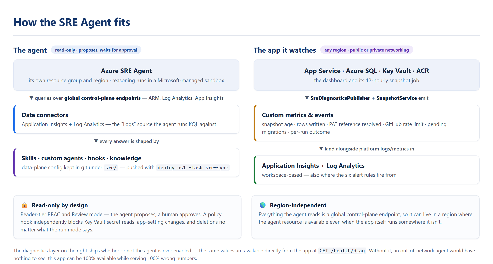

# Azure SRE Agent integration (optional)

An optional [Azure SRE Agent](https://learn.microsoft.com/azure/sre-agent/overview) — an AI
reliability agent — scoped to this deployment, giving deep troubleshooting over the app, its Azure
SQL database, and supporting services. **Off by default** (`enable_sre_agent = false`), and a
preview feature.

- [Why this app needs more than HTTP monitoring](#why-this-app-needs-more-than-http-monitoring)
- [Architecture](#architecture)
- [The diagnostics layer (ships either way)](#the-diagnostics-layer-ships-either-way)
- [What the agent knows about this app](#what-the-agent-knows-about-this-app)
- [What gets built](#what-gets-built)
- [Deploying it](#deploying-it)
- [Turning it off](#turning-it-off)
- [Constraints & caveats](#constraints--caveats)

## Why this app needs more than HTTP monitoring

The dashboard never calls GitHub live — a background job snapshots usage into Azure SQL every 12h,
and the UI only reads the DB. So the failures that actually matter here are **invisible to HTTP
monitoring**:

- the snapshot job silently stops → the site is 200 OK while serving month-old numbers
- a run "succeeds" but writes 0 rows, or the wrong rows → the app is fully up while wrong
- the Key Vault PAT reference never resolves → a GitHub 401 three layers from its cause

A billing app can be **100% available while 100% wrong**, and nothing in stock availability
monitoring catches it. This integration answers that in two parts: an always-on diagnostics layer
that makes those failures *visible*, and an agent on top that can *diagnose* them.

## Architecture

<p align="left">
  
</p>

The agent's reasoning runs in a Microsoft-managed sandbox and reaches this deployment through ARM,
Log Analytics, and Application Insights — all global control-plane endpoints. That's why it can sit
in a **different region** from the app (`Microsoft.App/agents` isn't available everywhere, Germany
West Central included) and still monitor it end to end.

The flip side of an out-of-network agent is that it can only see what the app publishes. That's what
the diagnostics layer is for.

## The diagnostics layer (ships either way)

`SreDiagnosticsPublisher` pushes the app's private-database health to Application Insights as custom
metrics, and `SnapshotService` emits per-run lifecycle events. This is plain app telemetry — it is
useful on its own and ships whether or not you ever enable the agent.

| Metric / event | Catches |
|---|---|
| `ghcp.snapshot.age_hours` | snapshot job stopped (>26h) |
| `ghcp.snapshot.rows_written` | succeeded-but-wrote-zero |
| `ghcp.github.token_resolved` | Key Vault PAT reference didn't resolve |
| `ghcp.github.rate_limit_remaining` | GitHub throttling pressure |
| `ghcp.db.pending_migrations` | schema warm-up / missing DDL grant |
| `ghcp.data.{costcenters,budgets,months_with_data}` | data-integrity floor |
| `SnapshotRunCompleted` / `SnapshotFailed` events | per-run detail (instanceId, duration, error) |

Reach the same values directly at `GET /health/diag` (authenticated) as a JSON dump.

Enabling the agent also creates **six metric alert rules** over exactly these signals — stale
snapshot, unresolved PAT reference, failed run, zero-row run, low GitHub rate limit, and
long-pending migrations — so the agent has alerts to investigate rather than only questions to
answer.

## What the agent knows about this app

A stock SRE Agent knows Azure. It doesn't know that a 200 OK here can mean stale billing data, or
that SQL error 40613 is usually a serverless resume rather than an outage. Four kinds of
configuration teach it that, all kept in git under [`sre/`](../sre/README.md) and pushed with
`./deploy.ps1 -Task sre-sync`.

### Skills — procedural troubleshooting guides

Skills load **automatically** when the agent judges one relevant to your question; you don't invoke
them. Each is a `skill.yaml` (name, description, allowed tools) plus a `SKILL.md` playbook with the
actual KQL and `az` steps.

| Skill | Loads when |
|---|---|
| `ghcp-snapshot-pipeline` | data looks stale, missing, or a snapshot run failed — the `SnapshotHostedService` → GitHub billing API → Azure SQL path, including per-error-string triage |
| `ghcp-data-integrity` | the dashboard is UP but the numbers look wrong — month-over-month swings, missing users or cost centers, a gap in the trend series, a suspected retention over-purge |
| `ghcp-sql-deep-dive` | Azure SQL performance or availability — serverless auto-pause vs. a real outage, CPU/DTU spikes correlated to snapshot runs, Query Store regressions, storage growth |
| `ghcp-private-network-path` | the app can't reach SQL, Key Vault, or GitHub in the private pattern — private endpoints, private DNS, forced-tunnel egress |
| `ghcp-identity-and-auth` | sign-in and identity failures — Entra client-secret expiry, the Easy Auth consistency check, managed-identity RBAC propagation for SQL/Key Vault/ACR |
| `ghcp-cost-and-sizing` | right-sizing questions — serverless-vs-provisioned SQL from real paused-hours data, App Service SKU fit, leftover deployment artifacts worth flagging |

### Custom agents — domain specialists you invoke

Unlike skills, these are **explicit**: invoke one with `/agent` in the SRE Agent chat. Each carries
standing instructions that survive a fresh conversation.

| Custom agent | What it's for |
|---|---|
| `ghcp_incident_triage` | The entry point for any alert or "something's wrong". Classifies first — availability / freshness / correctness / access — and is forbidden from concluding "healthy" off HTTP 200s alone. |
| `ghcp_db_expert` | Azure SQL specialist. Always establishes serverless-vs-provisioned first, so a 30–60s auto-pause resume isn't reported as an outage. Uses Query Store and the DMVs when the read-only SQL grant has run. |
| `ghcp_data_auditor` | Data-correctness audits: volume swings, gaps in the monthly trend series, orphaned rows, budget/cost-center drift. Read-only and safe to schedule. Treats a trend gap as HIGH — GitHub only serves the current month, so purged history is unrecoverable. |
| `ghcp_network_expert` | Private-networking failures, triaged in a fixed order (DNS → identity/RBAC → outbound egress) because each masquerades as the next one down. |

Agent-to-agent handoffs aren't supported in workspace mode, so the specialists are reached either by
you invoking them or by the relevant skill auto-loading.

### Hooks — the two gates

Hooks run inside the agent's own loop, so they hold regardless of run mode or how convincingly the
model justifies an action.

| Hook | Event | Does |
|---|---|---|
| `ghcp-policy-gate` | `PostToolUse`, blocking | Blocks the operations that would exfiltrate the GitHub PAT or mutate protected config — `keyvault secret show/set`, app-setting mutation, resource deletion. This is what keeps `github-pat` out of a conversation thread even though the agent can see the vault. |
| `ghcp-quality-gate` | `Stop`, prompt-based | Holds DATA and INCIDENT answers to a "show your evidence" bar: name the resource, the time window, the query, and the blind spots. A wrong-but-confident answer here reads exactly like a correct one. Deliberately **passes** security refusals and architecture/knowledge answers without demanding evidence, and nudges at most once (`maxRejections: 1`). |

### Knowledge files — the repo's own docs

`sre/knowledge/files.txt` lists the repo docs uploaded and indexed as agent knowledge: the README,
`infra/README.md`, `SECURITY.md`, the demo-data and SRE docs, and past security-review results. This
is how the agent answers "how is this app supposed to work?" without guessing.

## What gets built

| Layer | Where | Managed by |
|---|---|---|
| The agent + its RG + App Insights + two managed identities | `infra/sreagent.tf` (azapi) | Terraform |
| RBAC (agent identities read your resources; operator gets SRE Agent Administrator) | `infra/sreagent.tf` | Terraform |
| **Data connectors** (App Insights + Log Analytics — the "Logs" source) | `infra/sreagent.tf` (azapi) | Terraform |
| 6 alert rules over the diagnostics metrics | `infra/sreagent.tf` | Terraform |
| 6 skills | `sre/skills/` | `deploy.ps1 -Task sre-sync` |
| 4 custom agents | `sre/agents/` | `sre-sync` |
| 2 hooks | `sre/hooks/` | `sre-sync` |
| Knowledge files | `sre/knowledge/files.txt` | `sre-sync` |

Only the agent and its infra are ARM resources; skills, custom agents, hooks, and knowledge are
data-plane config — see [`sre/README.md`](../sre/README.md).

### Identities (two, by design)

- A **user-assigned identity** (`id-sre-*`) — referenced by `knowledgeGraphConfiguration.identity`
  and `actionConfiguration.identity`. It's REQUIRED at create time (a system-assigned identity
  doesn't exist yet during creation → `InvalidIdentity` 400), and carries the resource/log/KV-Reader
  roles + Monitoring Contributor.
- The agent's **system-assigned identity** — used by the data **connectors** (`identity = "system"`),
  so it carries its own Log Analytics Reader / Monitoring Reader / Reader on the app RG.

### Safety posture

- **Read-only by default.** Reader-tier RBAC; `sre_agent_mode = "Review"` (proposes, waits for
  approval). No sponsor group → no OBO write-elevation path.
- **Key Vault: control-plane Reader only.** The agent can see the vault's config but **never** read
  the `github-pat` secret — and the policy hook independently enforces that.
- **Evidence-backed answers.** The quality gate makes investigations cite their resource, time
  window, query, and blind spots.

## Deploying it

Prerequisites: the app itself must be deployed (the agent monitors it, and the alerts and skills key
off its telemetry), and the `Microsoft.App` provider registered (`deploy.ps1 -Task provision` does
this automatically when enabled).

1. Choose a supported region and enable the agent in `terraform.tfvars`:
   ```hcl
   enable_sre_agent   = true
   sre_agent_location = "swedencentral"   # NOT germanywestcentral — see the validation list
   # sre_agent_mode   = "Review"          # default; never Autonomous for SQL/Key Vault
   # sre_agent_sponsor_group_id = ""       # optional; leave empty for strictly read-only
   ```
2. Provision the agent (isolated from the app — a failure here never blocks the core deploy):
   ```
   ./deploy.ps1 -Task sre-provision
   ```
3. Grant the agent read-only SQL access (for DMV / Query Store depth):
   ```
   ./deploy.ps1 -Task grant-sre-sql
   ```
4. Sync the skills, custom agents, hooks, **and knowledge files** — all PUT/POSTed to the data-plane
   API. This needs the **SRE Agent Administrator** role on the agent (for the `https://azuresre.dev`
   token) — which `sre-provision` **grants to the deploying principal automatically** (subscription
   Owner is NOT sufficient; the data plane has its own RBAC). Set `sre_agent_admin_object_id` to point
   it at a shared ops group instead. If it's ever missing, `sre-sync` prints the exact `az role
   assignment create` command as a fallback.
   ```
   ./deploy.ps1 -Task sre-sync
   ```
5. Open the agent at [sre.azure.com](https://sre.azure.com) and try a question:
   *"Is the GHCP dashboard data current, and did the last snapshot succeed?"*

The `all` deploy (`./deploy.ps1`, answer yes to the SRE prompt) runs steps 1–4 for you — the agent is
fully configured end to end, no manual portal steps. It provisions last and non-fatally, so a
preview-API hiccup can never block the app.

## Turning it off

To remove just the agent and keep the app, set `enable_sre_agent = false` and re-provision —
`provision` reads the region from tfvars, so no `-Location` needed:

```hcl
enable_sre_agent = false
```
```
./deploy.ps1 -Task provision      # destroys the agent, its identities, connectors, RBAC, rg-sre-*
```

Or `cd infra ; terraform destroy` to remove the whole environment.

## Constraints & caveats

- **Preview feature.** `Microsoft.App/agents` and the VNet-integration path are preview; region
  availability and API shapes can change. Re-check supported regions with
  `az provider show -n Microsoft.App --query "resourceTypes[?resourceType=='agents'].locations"`.
- **Private SQL access.** In the private networking pattern, a Microsoft-managed sandbox can't reach
  the private SQL endpoint directly. The diagnostics metrics are the primary DB visibility; the
  optional VNet-integration path (deliberately NOT built here) would add live DMV access.
- **Max 5 active skills** at once — the agent loads the relevant ones per question, which is why six
  can be defined. Don't add more without consolidating. Chat is English-only.
- **Workspace-based App Insights.** Custom metrics and events land in the Log Analytics workspace
  under the `App*` tables (`AppMetrics`/`AppEvents`), not the classic `customMetrics`/`customEvents`
  tables. The alert rules and the skills' KQL are written for that schema and scoped to the
  workspace; pointing this at a *classic* App Insights would require rewriting them.
- **Query via the connector, not raw `az`.** The skills steer the agent to the "Monitor Workspace Log
  Query" tool backed by the Log Analytics connector. Raw `az monitor log-analytics query` needs the
  workspace **GUID** (customerId, not the name) plus the `log-analytics` extension — documented as a
  fallback in `ghcp-snapshot-pipeline`.
